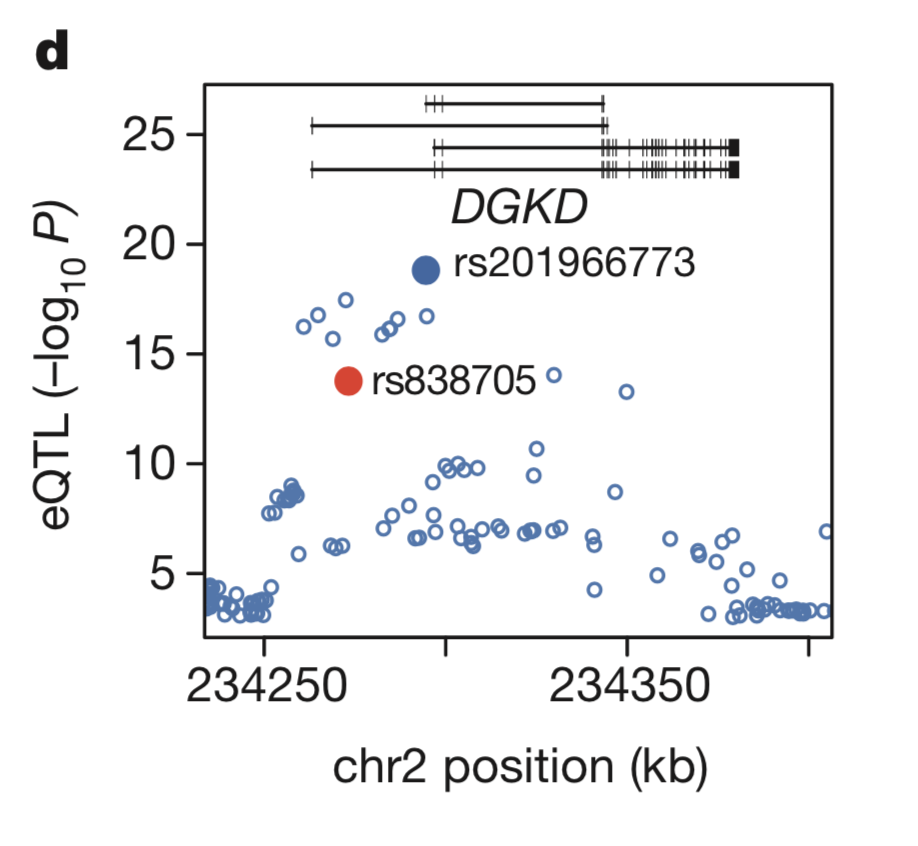

---

### III-2. eQTL Association Analysis

In this part, we will use [rvtest](http://zhanxw.github.io/rvtests) software for eQTL association analysis. 
Note that we are running just a simple score-based tests, so any other software should be fine for the basic analysis.

We will run single-variant score test with sex as covariate.
> <pre>
# Running association test
rvtest --inVcf cis_ENSG00000077044.vcf --pheno ENSG00000077044.ped \
	--covar ENSG00000077044.ped --covar-name SEX --out  output --single score </pre>
Note that there are 15 EUR samples that are part of GEUVADIS cohort but not part of 1000G Phase 3 genotypes. These
samples will be automatically removed from analyses due to genotypes missing.

Now, output will be created as output.SingleScore.assoc.

Let's look at the top 20 association results using 'sort':
> <pre>
grep -vw NA output.SingleScore.assoc |sort -k13g|head -20 </pre>

In fact, this gene, _DGKD_, has been selected based on the GEUVADIS paper's figure:

Let's find out which SNP is rs838705 and rs21966773 from the VCF file.
><pre>
grep rs838705 cis_ENSG00000077044.vcf |cut -f1-5</pre>

- Q. Is this SNP in our top-20 list? What's the p-value?

According to dbSNP, rs201966773 has merged into rs3075537
><pre>
grep rs3075537 cis_ENSG00000077044.vcf |cut -f1-5</pre>

- Q. Is this variant in our top-20 list? What's the p-value?

This eQTL association signal is interesting because _DGKD_ is a gene involved in calcium signaling pathway,
and it has been reported that rs838705 is associated with [calcium levels](https://www.ebi.ac.uk/gwas/search?query=rs838705).
It is possible that our top eQTL, rs3075537, is the causal variant affecting calcium levels due to regulatory mechanisms.

---

Feel free to ask questions to your instructor(s) if you are stuck. 
, or go back to [Day 2 Overview](../day2).

---
